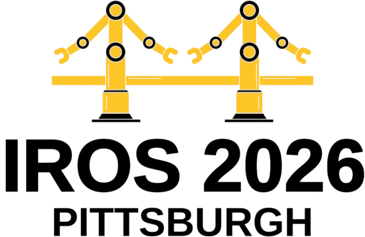

<div align="center">
<!--  -->
 &nbsp;&nbsp;&nbsp;&nbsp;&nbsp; 


  
# Quantile Transfer for Reliable Operating Point Selection in Visual Place Recognition


**[Dhyey Manish Rajani](https://www.linkedin.com/in/dhyey-rajani-1629881ab/), [Michael Milford](https://www.linkedin.com/in/michaeljmilford/), [Tobias Fischer](https://www.linkedin.com/in/tobiasrobotics/)**

*QUT Centre for Robotics* <br>
*School of Electrical Engineering and Robotics* <br>
*Queensland University of Technology, Brisbane, QLD 4000, Australia*

[Pre-print (arXiv)](https://arxiv.org/abs/2602.04401) | Project Page (coming soon)

</div>


## News

- 🎉🎉🎉 **[16th Jun 2026]** Paper accepted to the **IEEE/RSJ International Conference on Intelligent Robots and Systems (IROS) 2026** — Pittsburgh, PA, USA · Sep 27 – Oct 1, 2026!


## Citation

If you find this work useful, please cite:

```bibtex
@inproceedings{rajani2026quantiletransfer,
  author    = {Rajani, Dhyey Manish and Milford, Michael and Fischer, Tobias},
  title     = {Quantile Transfer for Reliable Operating Point Selection in Visual Place Recognition},
  booktitle = {2026 IEEE/RSJ International Conference on Intelligent Robots and Systems (IROS)},
  year      = {2026},
}
```


<!-- ## News
- 🎉 **[Jun 2026]** Paper accepted to the **IEEE/RSJ International Conference on Intelligent Robots and Systems (IROS) 2026**!-->

---

## 🚧 Code Coming Soon

The code for this project will be released here shortly. Star or watch this repo to be notified when it drops.

---

## Abstract

Visual Place Recognition (VPR) is a key component for localisation in Global Navigation Satellite System (GNSS)-denied environments, but its performance critically depends on selecting an image matching threshold (operating point) that balances precision and recall. 
Thresholds are typically hand-tuned offline for a specific environment and fixed during deployment, leading to degraded performance under environmental change.
We propose a method that automatically selects the operating point of a VPR system to maximise recall at 100\% precision. 
The method uses a small calibration traversal with known correspondences and transfers thresholds to deployment via quantile normalisation of similarity score distributions. 
This quantile transfer ensures that thresholds remain stable across calibration sizes and query subsets.
Experiments with seven state-of-the-art VPR techniques across five benchmark datasets demonstrate that our proposed approach consistently outperforms existing baselines, enabling the underlying VPR technique to operate at 100\% precision in approximately twice as many deployment scenarios (median improvement), while retrieving up to 29\% more correct matches at that precision.
The method eliminates manual tuning by adapting to new environments and generalising across operating conditions. 
Our code will be released upon acceptance.


